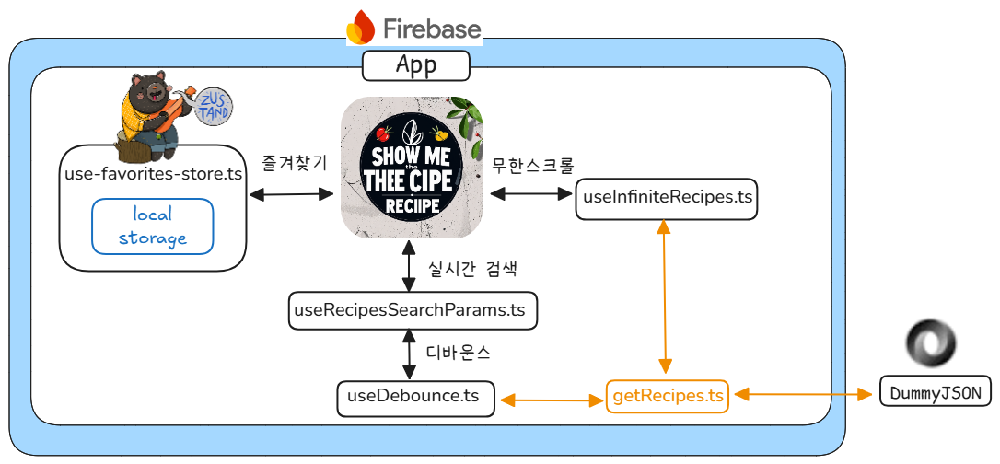

# SHOW ME THE RECIPES

## 프로젝트 소개

프로젝트 기간 : 2024.11.23~11.29

https://dummyjson.com 사이트의 Recipes 데이터를 불러와 실시간 검색, 무한스크롤, 즐겨찾기등을 구현한 페이지 입니다.

## 기술 스택


## 구현 기능

### 1. 무한 스크롤 기능 구현

useInfiniteQuery 와 react-intersection-observer를 활용하여 무한스크롤 기능 구현.

### 2. 실시간 검색 기능

nuqs라이브러리를 사용하여 URL 쿼리 파라미터를 React 상태처럼 쉽게 다룰 수 있어, 코드의 가독성과 유지보수성이 향상.검색요청에 0.5초의 디바운스를 적용. 사용자의 입력이 0.5초 동안 멈춘 후에만 API 요청을 보내도록 설정. 불필요한 API 호출을 줄이고 애플리케이션의 성능향상.

### 3. 즐겨찾기 기능 구현

zustand의 persist 미들웨어를 활용하여 localStorage 즐겨찾기 저장. Zustand의 persist 미들웨어는 상태를 localStorage에 자동으로 저장하고 불러올 수 있게 해주므로, 페이지 새로고침 후에도 데이터가 유지.즐겨찾기 페이지에서 확인 및 해제.

### 4. 레시피 별 상세 페이지

getRecipe.ts로 id를 넘겨주어 개별 recipe 데이터 페치하여 화면 구현.

## 프로젝트 아키텍쳐



## 실행 방법

```sh
$ git clone https://github.com/theo-jin/show-me-the-recipes.git
$ pnpm install
$ pnpm run dev
```

## 배포 링크

https://show-me-the-recipes.web.app/
